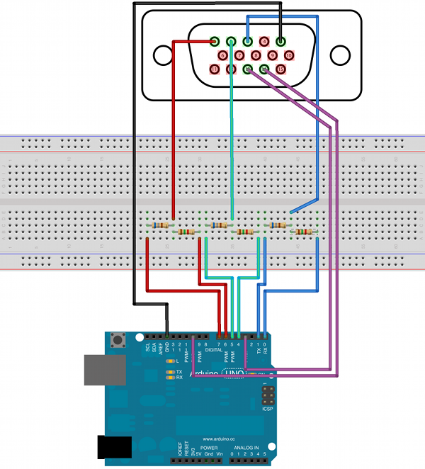
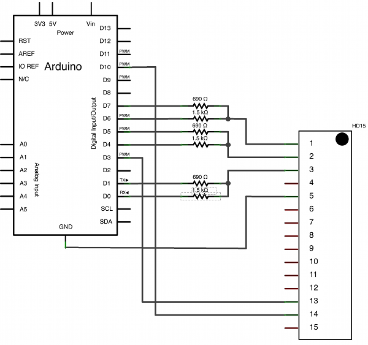

# Arduino-VGA64

A VGA library with 64 colors for Arduino.

The resolution is 40 x 30 pixels.

Authors: stg and jonasb.

## Schematic

All you need is:
* 1 Arduino
* 3 x 1.5kΩ resistors
* 3 x 690Ω resistors
* Monitor with a VGA cable
* wires

